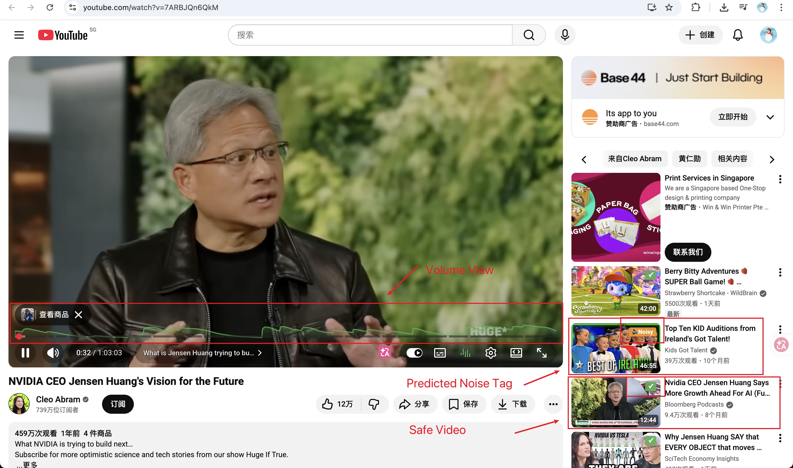

# SleepyTube

<div align="center">
  

  <h3>Transform YouTube into a sleep-safe audio experience</h3>

  [](https://opensource.org/licenses/MIT)
  [](https://chrome.google.com/webstore)

  
</div>

## What is SleepyTube?

SleepyTube is a Chrome extension that makes YouTube safe for sleeping by eliminating unpredictable audio stimuli that can wake you up. Whether you're listening to ASMR, podcasts, ambient sounds, or educational content to fall asleep, SleepyTube ensures you won't be startled awake by:

- 🔊 Sudden volume spikes (applause, laughter, sound effects)
- 📊 Inconsistent loudness between videos
- 🎵 Harsh high frequencies or rumbling bass
- 🗣️ Fast, stimulating speech

## ✨ Features

### Core Audio Protection
- **Smart Compression**: Automatically smooths out volume differences
- **Brickwall Limiter**: Hard cap on maximum volume to prevent sudden spikes
- **Auto Gain Control (AGC)**: Maintains consistent loudness across videos (-18 LUFS target)
- **Sleep EQ**: Reduces harsh frequencies for gentler sound

### Advanced Controls
- **Voice Focus Mode**: Enhances speech clarity while ducking background noise
- **Multiband Processing**: Separates low/mid/high frequencies for surgical control
- **Configurable Strength**: Light, Medium, or Strong compression presets
- **Sound Softening**: Natural, Gentle, or Ultra Soft EQ presets

### Intelligent Features
- **AI Video Quality Prediction** 🤖 NEW!: Predict audio quality before watching
  - Automatically analyzes video metadata (title, channel, duration)
  - Detects potential audio issues: noisy background music, volume inconsistency, sudden sounds, fast speech, high pitch
  - Visual badges on video thumbnails (✅ safe, ⚠️ warning, 🚨 danger)
  - Detailed tooltip showing specific issues
  - Supports free Gemini API or OpenAI API
  - 24-hour local cache to save API quota
  - Customizable badge position and size
  - Works on homepage, search results, and recommendations
- **Speech Rate Detection & Adjustment**: Automatically detects speaking speed and adjusts playback
  - Real-time syllable detection using audio energy analysis
  - Smart speed adjustment (slows fast speech, normal for comfortable pace)
  - Floating status panel with live metrics
  - User manual override with 30-second grace period
  - Pause/resume controls for full user control
  - Visual feedback with toast notifications
  - No conflicts with YouTube's native speed controls
- **Real-Time Audio Visualizer**: See the before/after comparison of audio processing
  - Live waveform display showing processing effects
  - Metrics dashboard with loudness, gain, peaks suppressed
  - Compression activity monitor
  - 60 FPS real-time updates
- **Fast UI Injection**: Button appears within 0.5-2 seconds (optimized loading)
- **Sleep Score** (Coming Soon): Rates videos for sleep-friendliness
- **One-Click Activation**: Toggle button integrated into YouTube player
- **Real-Time Processing**: Zero-latency audio modification
- **Settings Sync**: Configuration saved across browser sessions
- **Smart Fade In/Out**: Smooth 1-second volume transitions prevent sudden changes

## 🚀 Installation

### From Chrome Web Store (Recommended - Coming Soon)
1. Visit [Chrome Web Store - SleepyTube](https://chrome.google.com/webstore) _(coming soon)_
2. Click "Add to Chrome"
3. Confirm installation

### Manual Installation (Available Now)
1. **Clone this repository**:
   ```bash
   git clone https://github.com/IRONICBo/sleepytube.git
   cd sleepytube
   ```

2. **Open Chrome** and navigate to `chrome://extensions/`

3. **Enable "Developer mode"** (toggle in top-right corner)

4. **Click "Load unpacked"** and select the `extension` folder

5. **Done!** The SleepyTube icon should appear in your extensions toolbar

## 📖 Usage

### Quick Start
1. Open any YouTube video
2. Look for the Sleep Mode button (equalizer icon) in the player controls
3. Click to enable Sleep Mode - audio processing starts immediately
4. Right-click the button to open advanced settings
5. Click "Show Audio Monitor" to see real-time visualization of audio processing effects

### AI Video Prediction (NEW!) 🤖
Get audio quality predictions before watching videos:

1. **Get free API Key**:
   - Visit [Google AI Studio](https://makersuite.google.com/app/apikey)
   - Create a free Gemini API key (no credit card needed)
   - Copy the API key

2. **Configure in SleepyTube**:
   - Click the SleepyTube extension icon
   - Open Advanced Settings (gear icon)
   - Scroll to "AI Video Predictor"
   - Enable the toggle
   - Paste your API key
   - Save

3. **Start browsing**:
   - Open YouTube homepage or search results
   - Look for colored badges on video thumbnails:
     - ✅ **Green**: Audio quality good, safe for sleep
     - ⚠️ **Orange**: 1-2 potential issues
     - 🚨 **Red**: 3+ issues, not recommended
   - Hover over badges to see detailed issue list

**Detected Issues:**
- 🎵 Noisy background music
- 📊 Volume inconsistency
- ⚡ Sudden sound effects/laughter
- 💨 Fast speech rate
- 🎤 High-pitched voice
- ⚠️ Other audio problems

See [AI Predictor Guide](AI_VIDEO_PREDICTOR_GUIDE.md) for complete documentation.

### Recommended Settings
For best sleep experience, we recommend:\n- **Compression**: Medium or Strong
- **EQ**: Gentle or Ultra Soft
- **Voice Focus**: Enabled (for podcasts/ASMR with speech)
- **Auto Gain**: Enabled
- **AI Prediction**: Enabled (helps pre-screen videos)

### Keyboard Shortcuts
- `Alt+S`: Toggle Sleep Mode (configurable in Chrome settings)
- `Esc`: Close control panel

## 🔧 How It Works

SleepyTube uses the Web Audio API to process YouTube's audio in real-time:

```
Video Audio → Multiband Split → EQ → Compressor → AGC → Limiter → Output
```

### Technical Details
- **Compression**: Reduces dynamic range (quiet-to-loud difference)
- **Limiting**: Hard ceiling at -1.0 dBFS prevents clipping/distortion
- **AGC**: Slowly adjusts gain to maintain target loudness
- **Voice Focus**: Detects speech energy and reduces background frequencies

See [Technical Design Document](docs/1.tech-design.md) for full architecture details.

## 📸 Screenshots

<div align="center">
  
  <p><em>Sleep Mode activated on YouTube with Volume View visualization</em></p>
</div>

### Audio Visualizer
The visualizer shows real-time before/after comparison:
- **Top (Red)**: Original chaotic audio waveform
- **Bottom (Green)**: Processed smooth audio
- **Metrics**: Live stats showing compression, peaks blocked, and gain adjustments

See [Visualizer Guide](docs/VISUALIZER.md) for detailed usage instructions.

## 🤝 Contributing

We welcome contributions! Please see [CONTRIBUTING.md](CONTRIBUTING.md) for guidelines.

### Development Setup
```bash
# Clone repository
git clone https://github.com/IRONICBo/sleepytube.git
cd sleepytube

# Load extension in Chrome (see Manual Installation above)

# Make changes to code in extension/ directory

# Reload extension in chrome://extensions to test changes
```

### Project Structure
```
sleepytube/
├── extension/              # Chrome extension source
│   ├── manifest.json       # Extension configuration
│   ├── background/         # Service worker
│   ├── content/            # Content scripts (main logic)
│   ├── popup/              # Extension popup UI
│   ├── icons/              # Extension icons
│   └── assets/             # Additional resources
├── docs/                   # Documentation
│   ├── 0.product-design.md # Product specification
│   ├── 1.tech-design.md    # Technical architecture
│   ├── 2.features.md       # Feature roadmap
│   └── pages/              # GitHub Pages site
├── static/                 # Static assets
│   ├── icon.png            # App icon
│   └── banner.png          # Banner image
└── README.md               # This file
```

## 🔒 Privacy

SleepyTube is committed to user privacy:
- **Zero Telemetry**: No usage data sent to external servers
- **Local Processing**: All audio analysis done in-browser
- **No Recording**: Never stores or transmits audio streams
- **Minimal Permissions**: Only requires `storage` and YouTube host access

See [Privacy Policy](https://sleepytube.github.io/privacy) for details.

## 🔧 Troubleshooting

### Extension Not Working After Update

If you see errors like "AudioEngine is not a constructor" or "Unexpected token" after updating:

1. **Reload the extension**:
   - Go to `chrome://extensions/`
   - Find "SleepyTube"
   - Click the **refresh icon** (🔄) or toggle it off and on

2. **Hard refresh YouTube**:
   - Press `Ctrl+Shift+R` (Windows/Linux) or `Cmd+Shift+R` (Mac)
   - Or close all YouTube tabs and reopen

3. **Clear extension cache**:
   - Go to `chrome://extensions/`
   - Click "Remove" on SleepyTube
   - Re-install by clicking "Load unpacked" and selecting the `extension` folder

### Common Issues

**Sleep Mode button not appearing**:
- Refresh the YouTube page (`F5`)
- Check if extension is enabled in `chrome://extensions/`
- Try on a different video (some videos may take longer to load controls)

**Audio visualizer not showing**:
- Make sure Sleep Mode is enabled first
- Right-click the Sleep Mode button → click "Show Audio Monitor"
- Refresh the page if visualizer appears blank

**No audio after enabling Sleep Mode**:
- Check your system volume and YouTube player volume
- Try toggling Sleep Mode off and on
- Refresh the page

## ❓ FAQ

**Q: Does SleepyTube work on mobile?**
A: Currently Chrome extensions don't support mobile browsers. We're exploring mobile app options for the future.

**Q: Will this affect audio quality?**
A: Modern audio processing is imperceptible to most listeners. The slight compression/limiting trade-off is worthwhile for sleep safety.

**Q: Does it work with YouTube Premium/Music?**
A: Yes! SleepyTube works with any YouTube audio, including Premium and Music.

**Q: Can I use it with other websites?**
A: Currently YouTube-only. Future versions may support other platforms.

**Q: Is it compatible with other YouTube extensions?**
A: Generally yes, but extensions that modify audio (e.g., equalizers) may conflict.

## 📄 License

MIT License - see [LICENSE](LICENSE) for details.

## 🙏 Acknowledgments

- Inspired by community discussions about YouTube sleep audio challenges
- Built with Web Audio API and Chrome Extensions API
- Special thanks to reference projects:
  - [NebulaNorm](https://github.com/references/NebulaNorm)
  - [YouTube Volume Normalizer](https://github.com/Kelvin-Ng/youtube-volume-normalizer)

## ⚠️ Disclaimer

SleepyTube is an independent project and is not affiliated with, endorsed by, or sponsored by YouTube or Google.

---

<div align="center">
  <strong>Made with care for better sleep 🌙</strong>

  [Website](https://sleepytube.github.io) • [Chrome Store](https://chrome.google.com/webstore) • [GitHub](https://github.com/IRONICBo/sleepytube)
</div>
