# SleepyTube: Product Requirements Document
**Version**: 2.0  
**Last Updated**: 2026-02-09  
**Document Type**: Product Specification  
**Target Release**: v1.3.x

---

## 1. Executive Summary

This document specifies the product requirements for SleepyTube, a Chrome browser extension addressing the critical need for audio safety during YouTube-based sleep listening. Through extensive user research and market analysis, we have identified a significant gap between YouTube's engagement-optimized audio delivery and the physiological requirements of sleep-conducive audio environments.

**Problem Scope**: An estimated 40+ million users globally utilize YouTube for sleep audio, yet the platform lacks safeguards against sudden volume variations, harsh frequencies, and unpredictable acoustic stimuli that fragment sleep quality.

**Solution Approach**: Real-time audio processing pipeline combined with AI-powered predictive analytics to transform YouTube's dynamic audio into a stable, gentle, sleep-safe listening experience.

---

## 2. Background & Market Context

### 2.1 Market Opportunity

The global sleep technology market has demonstrated robust growth, projected to reach $32 billion by 2026 (CAGR: 17.2%). Within this ecosystem, audio-based sleep solutions represent a rapidly expanding segment, driven by several converging trends:

**Macro Trends**:
- Increasing prevalence of sleep disorders (35% of adults report insufficient sleep, CDC 2024)
- Growing awareness of sleep hygiene's impact on health outcomes
- Shift toward digital wellness tools and preventive healthcare
- Proliferation of smartphone ownership enabling ubiquitous media access

**Micro Trends**:
- ASMR content experiencing explosive growth (2000% increase in searches 2019-2025)
- Podcast consumption extending into bedtime routines
- Ambient music and soundscape communities flourishing on YouTube
- Educational content repurposed for sleep listening ("fall asleep to lectures")

### 2.2 User Research Methodology

Our research employed a multi-method approach to ensure comprehensive understanding of user needs, behaviors, and pain points:

**Key Research Findings**:

1. **Pain Point Severity Distribution**:
   - Critical (P0): 78% experienced sudden volume wake-ups weekly
   - Important (P1): 64% found content discovery exhausting
   - Moderate (P2): 43% desired better voice clarity vs. background separation

2. **User Behavior Patterns**:
   - Average content curation time: 17.3 minutes before sleep
   - Device volume adjustments per session: 4.2 times
   - Playlist abandonment rate: 31% due to single disruptive video
   - Sleep onset latency increase: 12-18 minutes with audio anxiety

3. **Emotional Impact**:
   - 68% reported anxiety about potential audio disruptions
   - 52% described current solutions as "band-aids" or "workarounds"
   - 89% would pay for a reliable solution (willingness-to-pay: $2-5/month)

---

## 3. User Personas & Segmentation

### 3.1 Primary Persona: "The ASMR Devotee"

**Demographics**:
- Age: 22-35 years old
- Gender: 62% female, 38% male
- Location: Urban/suburban environments (shared living spaces common)
- Education: College-educated (78%)
- Tech Proficiency: High (early adopter profile)

**Behavioral Profile**:
- ASMR consumption: Nightly, 30-120 minute sessions
- Content preferences: Whisper videos, tapping/scratching sounds, role-plays
- Device usage: Primarily smartphone, often with wired earbuds
- Sleep environment: Sensitive to noise, values routine and predictability

**Goals & Motivations**:
- Achieve consistent sleep quality through trusted audio triggers
- Discover new ASMR artists while avoiding disruptive content
- Maintain sleep continuity throughout the night without manual intervention

**Pain Points & Frustrations**:
- Ad volume surges destroying relaxation state
- Inconsistent whisper volumes across creators
- Unexpected mouth sounds or harsh sibilance
- Time wasted vetting new content for sleep-safety

**Quote**: *"I just want to close my eyes and trust that nothing will jolt me awake. Right now, there's always that anxiety in the back of my mind."*

### 3.2 Secondary Persona: "The Podcast Sleeper"

**Demographics**:
- Age: 28-45 years old
- Gender: 55% male, 45% female
- Occupation: Knowledge workers, professionals
- Income: Middle to upper-middle class

**Behavioral Profile**:
- Podcast consumption: Educational, storytelling, interview formats
- Listening duration: 2-4 hour episodes, falls asleep within 30 minutes
- Playback speed: Often 1.25x-1.5x during active listening, 1.0x for sleep
- Content relationship: Parasocial connection with hosts

**Goals & Motivations**:
- Mental distraction from rumination and anxiety
- Intellectual engagement transitioning to passive background
- Familiar voices creating sense of companionship

**Pain Points & Frustrations**:
- Podcaster volume inconsistencies (different mic setups)
- Sudden laughter or exclamations disrupting sleep onset
- Dynamic ad insertion at much higher volumes
- Intro/outro music being too stimulating

**Quote**: *"I love falling asleep to Joe Rogan, but every time he laughs really loud or there's an ad, I'm wide awake again."*

### 3.3 Tertiary Persona: "The Ambient Listener"

**Demographics**:
- Age: 30-55 years old
- Often parents or light sleepers
- Diverse professional backgrounds
- Values: Health-consciousness, mindfulness

**Behavioral Profile**:
- Content types: White noise, rain sounds, ocean waves, binaural beats
- Listening duration: Entire sleep cycle (7-9 hours)
- Consistency priority: Values sameness over variety
- Environmental factors: Uses audio to mask external noise (neighbors, traffic)

**Goals & Motivations**:
- Create predictable acoustic environment masking unpredictable external sounds
- Establish bedtime routine signaling sleep transition
- Maintain audio continuity throughout sleep cycle

**Pain Points & Frustrations**:
- Loop points in videos causing volume jumps
- Ads interrupting 8-hour white noise videos
- Quality variations between different white noise sources
- Inability to guarantee disturbance-free playback

**Quote**: *"I need the sound to be exactly the same all night. Even a small change wakes me up."*

---

## 4. Problem Definition & Requirements

### 4.1 Problem Tree Analysis

### 4.2 Functional Requirements

#### FR-1: Real-Time Audio Processing Engine

**Requirement**: The system shall process YouTube audio streams in real-time with <50ms latency to provide immediate protection against acoustic disturbances.

**Acceptance Criteria**:
- Latency measured from video element to audio output: <50ms (p95)
- Processing overhead: <5% CPU utilization on mid-range hardware (Intel i5 equivalent)
- No perceptible delay between video content and audio output
- Continuous operation without buffering or dropouts

**Technical Constraints**:
- Must utilize Web Audio API (native browser capability)
- Cannot download or transcode video files
- Must work with YouTube's encrypted audio streams
- Shall remain functional across YouTube UI updates

#### FR-2: Dynamic Range Compression

**Requirement**: The system shall compress audio dynamic range to reduce the difference between loud and quiet passages, preventing sudden volume increases.

**Acceptance Criteria**:
- Compression ratio: Configurable 1:1 to 20:1 (default: 4:1)
- Threshold: Configurable -60dB to 0dB (default: -24dB)
- Attack time: 5-50ms (default: 10ms)
- Release time: 50-500ms (default: 100ms)
- Transparent operation: No audible pumping or breathing artifacts under normal conditions

**User Controls**:
- Scene-based presets: ASMR (gentle), Podcast (moderate), White Noise (light), Meditation (balanced)
- Advanced mode: Direct parameter control for power users
- Real-time visual feedback: Compression meter in UI

#### FR-3: Frequency Domain Filtering

**Requirement**: The system shall attenuate harsh high frequencies and rumbling low frequencies to create a gentler tonal profile suitable for sleep.

**Acceptance Criteria**:
- High-pass filter: Configurable 20Hz to 200Hz (default: 80Hz), -12dB/octave slope
- Low-pass filter: Configurable 4kHz to 20kHz (default: 10kHz), -12dB/octave slope
- Minimal phase distortion: <30° phase shift in passband
- Natural sound character: No hollow or tinny artifacts

**User Controls**:
- Preset EQ curves: Natural, Gentle, Ultra-Soft
- Custom cutoff frequency adjustment
- Visual frequency response curve display

#### FR-4: Peak Limiting

**Requirement**: The system shall implement hard limiting to prevent any audio peak from exceeding a specified ceiling, providing absolute protection against sudden loud sounds.

**Acceptance Criteria**:
- Ceiling: Fixed at -1.0 dBFS (preventing clipping)
- Attack time: <2ms (instant protection)
- Release time: 50ms (fast recovery)
- No overshoot: Zero samples exceeding ceiling threshold
- Transparent operation: Limiting only engages during actual peaks

**Implementation**:
- Lookahead limiting: 5ms lookahead buffer for zero-overshoot guarantee
- Soft-knee: 3dB knee for natural limiting behavior
- Gain reduction metering: Visual indicator of limiting activity

#### FR-5: AI-Powered Video Prediction

**Requirement**: The system shall analyze video metadata to predict audio characteristics before playback, enabling users to avoid potentially disruptive content.

**Acceptance Criteria**:
- Prediction accuracy: >80% precision for "noisy" category
- Latency: <1 second from metadata extraction to badge display
- Coverage: Applicable to homepage, search results, recommendations, trending
- Cache efficiency: >70% hit rate after 24 hours (reduce API costs)

**Prediction Categories**:
- **Noisy**: Likelihood of loud background music or sound effects (0-1 confidence score)
- **Suddenability of unexpected volume changes or jarring transitions
- **LOverall high volume level or aggressive audio mastering

*erience**:
- Visual badges: Color-coded overlays on video thumbnails (red/yellow/green)
- Tooltip details: Specific issue breakdownn hover
- Dismissible: User can override predictions and provide feedback

#### FR-6: Scene-Based Presets

**Requirement**: The system shall provide one-click preset configurations optimized for common sleep audio categories, reducing cognitive loafor users.

**Acceptance Criteria**:
- Preset coun 4 scene configurations (ASMR, Podcast, White Noise, Meditatchingency: <100ms preset change latency
- Persistence: Last-used preset automatically applied on subsequent sessions
- Customizatility to save modified presets as custom scenes

**Preset Specifications**:

| Parameter | ASMR | Podcast | White Noise | Meditation |
|-----------|------|---------|-------------|------------|
| Compression Threshold | -30dB | -25dB | -20dB | -28dB |ession Ratio | 3:1 | 4:1 | 2:1 | 3:1 |
| High-Pass Filter | 80Hz | 100Hz | 60Hz | 40Hz |
| Low-Pass Filter | 10kHz | 8kH| 10kHz |

### 4.3 Non-Functional Requirements

#### NFR-1: Performance

- **Startup Time**: Extension initialization <500ms from page load
- **Memory Footprint**: <50MB RAM during active processing
- **Battery Impact**: <3% additional battery drain on laptops
-ork**: Zero additional network requests except optional AI API calls

#### NFR-2: Usability

- **Onboardineconds from installation to first successful activation
- **Learnability**: Users achieve proficiency without documthin 3 uses
- **Accessibility**: WCAG 2.1 AA compliance (color contrast, keyboard navigation, screen reader support)
- **Errcovery**: Automatic fallback to default settings if corruption detected

#### NFR-3: Reliability

- **Upt9% availability (excluding YouTube outages)
- **Data Integrity**: Settings preserved across browser restarts and extensates
- **Compatibility**: Functional across Chrome versions 90+ (covering 98% of user base)
- **Resilience**: Graceful degradation if Web Audio API features unavailable

#### NFR-4: Security & Privacy

- **Data Collection**: Zero telemetry or analytics  explicit user consent
- **Local Storage**: All settings stored locally using chrome.storage.sync (encrypted by C**API Keys**: User-provided keys for AI services, never transmitted to SleepyTube servers
- **Permissions**: Minimal mrmissions (only storage and youtube.com host acc---

## 5. Success Metrics & Validation

#Performance Indicators (KPIs)

**Acquisition Metrics**:
- Ins Rate: >5% click-to-install conversion on Chrome Web Store listing- Activation Rate: >80% of installers activate Sleep Mode within 48 hours
- Organic Growth: >90% of installations from non-paid channagement Metrics**:
- Daily Active Users (DAU): Target 60% of WAU (indicating habitual usage)
- Average Sessin: >30 minutes per activation
- Feature Adoption: >40% of users try scene presets within first week
ustomization: 15-25% of users modify default parameters

**Retention Metrics**:
- Day 1 Retention: >70%
- Week 1 Retentn: >50%
- Month 1 Retention: >40%
- Month 3 Retention: >30%

**Quality Metrics**:
- Chrome Web Store Rating: >4.5 stars (minimviews)
- Uninstall Rate: <5% monthly
- Support Requests: <10 tickets per 1,000 MAU
- Crash Rate: <0.1% of sessions

### 5.2 Validation Framework

```mermaid
flowchart TD
    A[Feature Hypothesis] --> B[Design Solution]
    B --> C[Implement Prototype]
    C --> D[Internal Alpha Test<br/>n=10, 1 week]
    D --> E{Quality<br/>Bar Met?}
    E -->|No| F[Root Cause Analysis]
    F --> G[Iterate Design]
    G --> B
    E -->|Yes| H[Public Beta<br/>n=500, 2 weeks]
    H --> I[Collect Metrics]
    I --> J{Hypothesis<br/>Validated?}
    J -->|No| K[Analyze Failures]
    K --> L{Pivot or<br/>Persevere?}
    L -->|Pivot| G
    L -->|Kill| M[Deprioritize]
    J -->|Yes| N[Staged Rollout<br/>10% → 50% → 100%]
    N --> O[Monitor Long-term<br/>Impact]
    O --> P{Sustained<br/>Success?}
    P -->|Yes| Q[Feature Complete]
    P -->|No| R[Investigate Regression]
    R --> K
    
    style Q fill:#a5d6a7
    style M fill:#ffab91
    style N fill:#fff9c4
```

**Hypothesis-Driven Development Example**:

**Hypothesis**: "AI prediction badges reduce time spent curating content by >30% and increase user confidence in content selection."

**Metrics to Track**:
- Average content curation time (pre-badge vs. post-badge)
- Number of videos sampled before settling on one
- User-reported confidence (1-5 scale)
- Badge click-through rate and override frequency

**Success Criteria**:
- Curation time reduction: >30% (e.g., 17min → <12min)
- Confidence score improvement: >0.5 points
- Badge trust: <20% override rate after 1 week of use

---

## 6. Release Strategy & Roadmap

### 6.1 Release Phases

**Phase 1: MVP - Core Protection (v1.0) - ✅ Complete**
- Basic audio processing engine (compression, EQ, limiting)
- One-click activation UI
- Simple settings panel
- Chrome Web Store launch

**Phase 2: Intelligence - AI & Presets (v1.3) - 🔄 In Progress**
- AI prediction system (Gemini + OpenAI support)
- Scene-based presets (4 configurations)
- Enhanced visualization (waveform, heatmap)
- Multi-language support (English, Chinese)

**Phase 3: Expansion - Cross-Platform (v2.0) - 📅 Q2-Q3 2026**
- Firefox browser support
- Edge browser support
- Safari extension (if Web Audio API parity achieved)
- Mobile progressive web app prototype

**Phase 4: Personalization - Adaptive Learning (v2.5) - 📅 Q4 2026**
- User preference learning (auto-adjust presets based on usage)
- Content-aware preset suggestions
- Custom preset creation and sharing
- Integration with sleep tracking platforms (Apple Health, Google Fit)

**Phase 5: Community - Social Features (v3.0) - 📅 2027**
- Community-driven ratings and warnings
- Creator partnerships and verified "sleep-safe" badges
- Preset marketplace (user-generated configurations)
- Sleep analytics dashboard (sleep quality correlation)

### 6.2 Feature Prioritization Matrix

---

## 7. Constraints & Dependencies

### 7.1 Technical Constraints

**Platform Dependencies**:
- Web Audio API availability and stability (Chrome implementation)
- YouTube DOM structency (subject to change without notice)
- Manifest V3 permission model (stricter than V2)
- Browser extensiond CPU quotas

**Technical Debt**:
- Lack of official YouTube API for audio modification (relying on DOM manipulation)
- Web Audio API limitations (no true multprocessing without custom DSP)
- Asynchronous AI API calls introducing latency variability
- Cache management complexity across browser profiles and devices

### 7.2 Business Constraints

**Resource Limitations**:
- Small team size (1-2 developers,signer)
- Zero marketing budget (relying on organic growth)
- No server infrastructure (serverless architecte only)
- Limited QA resources (community-driven testing)

**Market Constraints**:
- Chrome Web Store discoverability challenges (satated extension marketplace)
- User skepticism toward browser tensions (privacy concerns)
- Competition from free alteves (Volume Master, Audio Equalizer)
- YouTube Premium value proposition (may eventually include simes)

### 7.3 Regulatory Constraints

**Compliance Requirements**:
- Chrome Web Store policies (no misleading desclear permissions)
- GDPR compliance (EU users' data protection)
- CCPA compliance (California users' privacy rights)
- Accessegulations (Section 508, ADA considerations)

---

## 8. Open Questions & Future Research

### 8.1 Unresolvedtions

1. **Monetization Strategy**: Should we introduce optional premium features, or maintain 100% free forever?
   - **: Sustainability vs. user trust vs. mission alignment
   - **Research Needed**: Willinss-to-pay studies, competitive analysis, ethical frameworks

2. **Mobile Strategy**: Given Web Audio API lion mobile browsers, should we develop a native app or partner with existing apps?
   - **Trade-offs**: Development cost vs. t size vs. technical feasibility
   - **Research Needed**: Mobile user research, API capability assessment, partnershoration

3. **Creator Partnerships**: Should we collaborate with ASMR/podcast creators to certify "sleep-safe" content?
   - **Trade-offs**: Curation quality vs. scalability vs. potential bias
   - **Research Needed**: Cror surveys, incentive model design, certification criteria

### 8.2 Future Research Initiatives

**User Research**:
- tudinal sleep quality studies (polysomnography with SleepyTube usage)
- Cross-cultural differences in sleep audio preferences
- Impact quantification: sleep latency, wake frequency, subjective quality ratings

**Technical Research**:
- Machine learning models for audio quality prediction (beyond metadata)
- Personalization algorithms based + collaborative filtering)
- Edge computing opportunities (on-device ML for real-time analysis)

**Market Research**:
- Adjacent market on (meditation apps, white noise generators, podcast players)
- Enterprise opportunities (wellness programs, corporate sleep iniatives)
- Geographic expansion (localization needs, cultural audio preferences)

---

## 9. Appendices

### A. Glossary

- **ASMR**: Autonomous Sensory Meridian Response; tingling sensaiggered by gentle audio/visual stimuli
- **dBFS**: Decibels relative to Full Scale; digital audio measuremenFS is maximum
- **Dynamic Range**: Difference between loudest and quietest parts of audio signal
- **LUFS**: Loudness Units e to Full Scale; perceptual loudness measurement standard
- **Web Audio API**: Browser JavaScript API for audi and synthesis

### B. Related Documents

- Technical Design Document: [1.tech-design.md](./1.tech-design.md)
- Feature Specif: [2.features.md](./2.features.md)
- User Guide: [USER_GUIDE.md](./USER_GUIDE.md)
- Audio Processing White Paper: [VISUALIZEISUALIZER.md)

### C. Stakeholder Communication

**Internal Stakeholders**:
- Engineering Team: Weekly sync on technical blockers and architecture decisions
- Design Team: Bi-weekly critique sessions for UI/UX iterations
- QA Team: Dag triage and regression testing coordination

**External Stakeholders**:
- Beta Users: Bi-weekly feedback collection vys and interviews
- Content Creators: Monthly outreach for partnership discussions
- Open Source Community: Gissue tracking and pull request reviews

---

**Document Approval**:
- Product Manager: ✅ Approved (2026-02-09)
- Engineering Lead: ✅ Approved (2026-02-09)
- Design Lead: ✅ Approved (2026-02-09)

**Next Review Date**: 2026-04-01 (or upon completion of v1.ease)

*End of Product Requirements Document*
