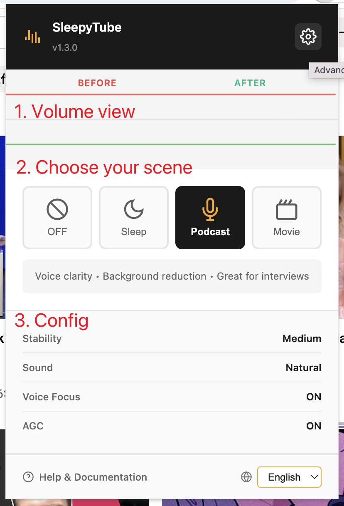
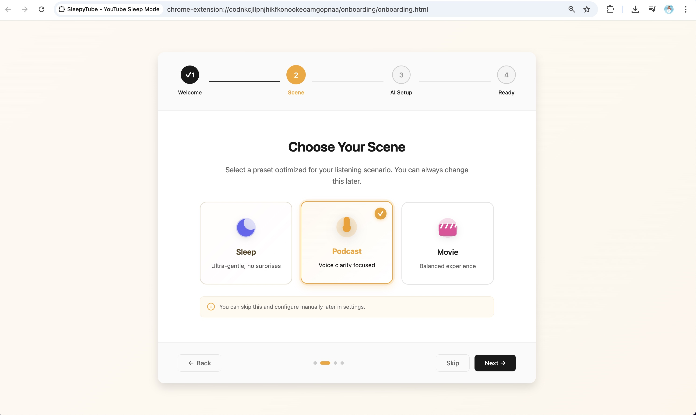
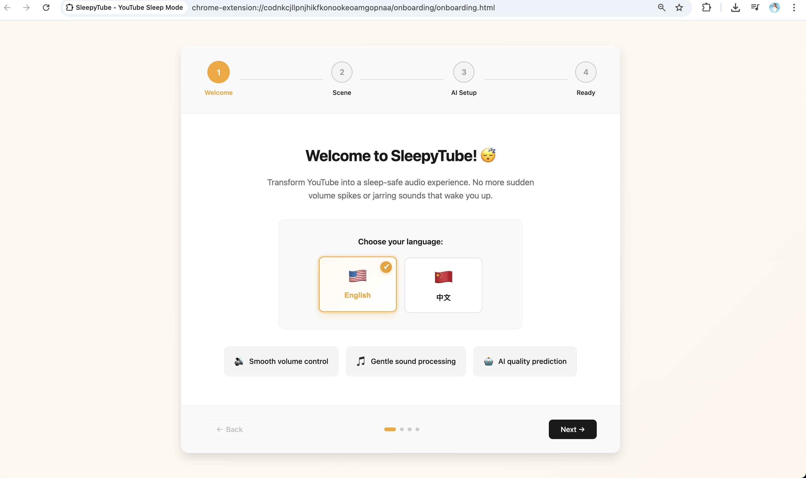
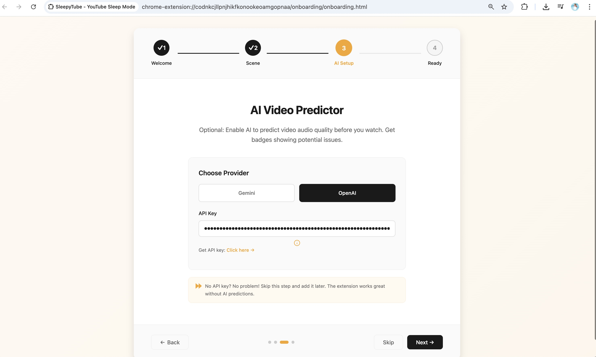
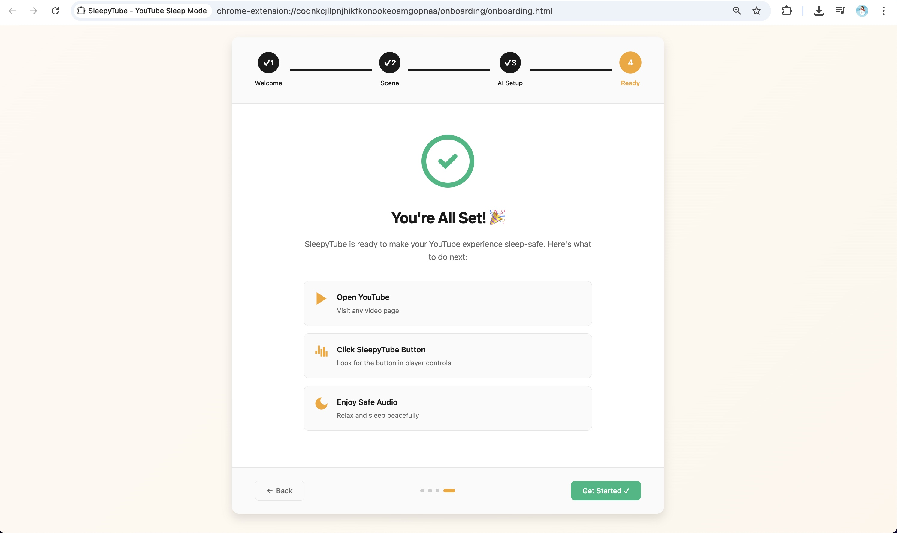
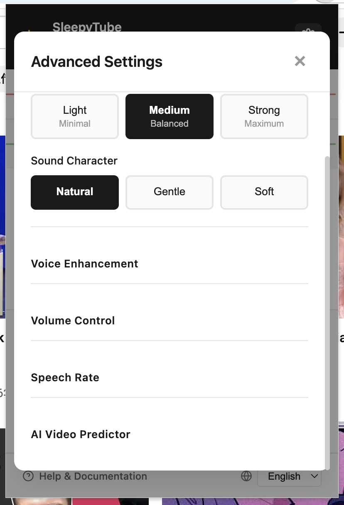

# SleepyTube User Guide

## 📖 Welcome to SleepyTube!

**SleepyTube** is a Chrome browser extension designed for users who watch YouTube videos while falling asleep. It intelligently stabilizes volume and eliminates sudden audio spikes, ensuring a peaceful sleep experience.

**Version**: v1.3.2  
**Last Updated**: 2026-02-08  
**Supported Platform**: Chrome Browser (Version 90+)

---

## 🌟 Core Features

SleepyTube transforms your YouTube experience with four powerful features designed for sleep safety:

### 1. 🎚️ Intelligent Volume Stabilization


Automatically normalizes audio levels across different videos and prevents sudden volume spikes that could wake you up. Our advanced audio engine ensures consistent, comfortable listening levels throughout your sleep session.

**Key Benefits:**
- Real-time dynamic range compression
- Prevents audio jumps between videos
- Customizable compression threshold and ratio

### 2. 🎵 Gentle Audio Processing


Filters out harsh high frequencies and rumbling low frequencies that can disturb sleep. Creates a warm, soothing audio profile optimized for relaxation.

**Key Benefits:**
- Removes piercing highs above 8kHz
- Reduces rumbling bass below 100Hz
- Smooth frequency response curve

### 3. 🤖 AI Video Quality Prediction


Uses AI to predict potential audio issues before you click play. Labels videos with warnings about loud sounds, sudden noises, or volume inconsistencies.

**Key Benefits:**
- Predict audio quality before watching
- Avoid videos with disruptive audio
- Save time finding sleep-friendly content
- Supports Google Gemini and OpenAI

### 4. 🎭 Scene-Based Presets


One-click presets optimized for different sleep scenarios - whether you're listening to ASMR, podcasts, white noise, or meditation content.

**Key Benefits:**
- Pre-configured settings for common use cases
- Quick switching between scenes
- Customizable scene parameters

---

## 📑 Table of Contents

1. [Installation](#1-installation)
2. [First-Time Setup - Onboarding](#2-first-time-setup---onboarding)
3. [Basic Usage](#3-basic-usage)
4. [Scene Modes Explained](#4-scene-modes-explained)
5. [Advanced Settings](#5-advanced-settings)
6. [AI Video Prediction](#6-ai-video-prediction)
7. [FAQ](#7-faq)
8. [Troubleshooting](#8-troubleshooting)

---

## 1. Installation

### Method 1: Chrome Web Store (Recommended)

> ⚠️ **Note**: Not yet published to Chrome Web Store. Coming soon!

**Steps**:
1. Visit Chrome Web Store
2. Search for "SleepyTube"
3. Click "Add to Chrome"
4. Confirm installation

### Method 2: Manual Installation (Developer Mode)

**Prerequisites**:
- Chrome Browser (Version 90 or higher)
- Source code downloaded from GitHub

**Installation Steps**:

```
Step 1: Download Source Code
├─ Visit: https://github.com/IRONICBo/SleepyTube/releases
├─ Download the latest release ZIP file
└─ Extract to a local folder

Step 2: Open Chrome Extensions Page
├─ Enter in address bar: chrome://extensions/
├─ Press Enter
└─ Enable "Developer mode" toggle (top right)

Step 3: Load Extension
├─ Click "Load unpacked" button (top left)
├─ Navigate to the extracted folder
├─ Select the `/extension` folder (not root directory!)
└─ Click "Select Folder"

Step 4: Verify Installation
├─ "SleepyTube" card appears in extensions list
├─ "Enabled" shown in bottom right of card
└─ SleepyTube icon appears in browser toolbar
```

**Common Issues**:
- **Q: "Cannot load extension" error?**
  - A: Ensure you selected the `extension` folder, not the project root
- **Q: Icon not showing in toolbar?**
  - A: Click the puzzle icon in toolbar, then pin SleepyTube

---

## 2. First-Time Setup - Onboarding

After installation, SleepyTube automatically opens an onboarding guide to help you configure quickly.

### Step 1: Language Selection


**Content**:
- 🌍 Choose your preferred language
- Options: English / 中文

**Action**:
- Click your language button to continue

### Step 2: Choose Your Scene


**Content**:
- 🎭 Select your primary use case
- **ASMR**: Optimized for whispers and gentle sounds
- **Podcast**: Balanced for speech clarity
- **White Noise**: Consistent ambient sound processing
- **Meditation**: Gentle, relaxing audio profile

**Action**:
- Click your preferred scene
- Click "Next" to continue

### Step 3: AI Setup (Optional)


**Content**:
- 🤖 Configure AI video quality prediction
- Choose provider: Google Gemini (Free) or OpenAI
- Enter API key

**Action**:
- Skip if not using AI features
- Or enter your API key and click "Save & Next"

### Step 4: You're All Set!


**Content**:
- ✅ Setup complete!
- Quick tips for using SleepyTube

**Action**:
- Click "Start Using" to finish

---

## 3. Basic Usage

### 3.1 Activating Sleep Mode

**On Video Pages**:
1. Navigate to any YouTube video (`youtube.com/watch?v=...`)
2. Look for the **Sleep Mode button** next to the video player
3. Click the button to activate
4. Audio processing starts immediately

**Indicators**:
- Button turns **blue** when active
- Mini waveform appears showing real-time audio processing
- Toast notification confirms activation

### 3.2 Using the Popup Interface


**Accessing Settings**:
1. Click the SleepyTube icon in browser toolbar
2. Popup window opens showing current settings

**Popup Sections**:

**Scene Selection**
- Quick buttons for 4 preset scenes
- Currently active scene highlighted
- Click any button to switch scenes

**Volume Control**
- **Voice Enhancement**: Boost speech clarity (0-100%)
- **Background Reduction**: Reduce background noise (0-100%)
- Sliders update in real-time

**AI Provider**
- Switch between Google Gemini and OpenAI
- Status indicator shows if API key is configured

**Additional Options**
- **Settings**: Open full settings page
- **Language**: Switch UI language
- **Help**: Open user guide

### 3.3 Viewing Audio Visualizer

**Mini Waveform (In-Page)**:
- Appears automatically when Sleep Mode is active
- Shows real-time audio levels
- Color-coded: Green (normal), Yellow (compressed), Red (clipping)

**Compression Heatmap**:
- Visual indicator of compression activity
- Brighter colors = more compression applied
- Helps understand how audio is being processed

---

## 4. Scene Modes Explained

Each scene is pre-configured for specific content types. Here's what they do:

### 🎙️ ASMR Mode

**Optimized For**: Whisper videos, soft spoken content, tapping sounds

**Settings**:
- **Compression Threshold**: -30 dB (gentle)
- **Compression Ratio**: 3:1 (moderate)
- **High-Pass Filter**: 80 Hz (remove rumble)
- **Low-Pass Filter**: 10 kHz (preserve whispers)

**Use Cases**:
- ASMR role-plays
- Whispered storytelling
- Gentle tapping/scratching sounds
- Soft-spoken relaxation guides

**Why These Settings?**
- Gentle compression preserves subtle sounds
- High-pass removes room rumble without affecting voice
- Low-pass keeps whispers natural while removing harshness

---

### 🎧 Podcast Mode

**Optimized For**: Talk shows, interviews, audiobooks

**Settings**:
- **Compression Threshold**: -25 dB
- **Compression Ratio**: 4:1
- **High-Pass Filter**: 100 Hz
- **Low-Pass Filter**: 8 kHz

**Use Cases**:
- Joe Rogan Experience
- Serial podcasts
- Educational lectures
- Audiobook narrations

**Why These Settings?**
- Stronger compression evens out speaker volume differences
- High-pass removes background noise
- Low-pass reduces sibilance (harsh 's' sounds)

---

### 🌊 White Noise Mode

**Optimized For**: Rain sounds, ocean waves, fan noise

**Settings**:
- **Compression Threshold**: -20 dB
- **Compression Ratio**: 2:1 (light)
- **High-Pass Filter**: 60 Hz
- **Low-Pass Filter**: 12 kHz

**Use Cases**:
- Rain/thunderstorm videos
- Ocean wave recordings
- Fan/ventilation sounds
- Nature ambience

**Why These Settings?**
- Light compression maintains natural dynamics
- Wide frequency range preserves natural sound
- Minimal processing for authentic ambience

---

### 🧘 Meditation Mode

**Optimized For**: Guided meditations, binaural beats, singing bowls

**Settings**:
- **Compression Threshold**: -28 dB
- **Compression Ratio**: 3:1
- **High-Pass Filter**: 40 Hz
- **Low-Pass Filter**: 10 kHz

**Use Cases**:
- Guided meditation sessions
- Binaural beat therapy
- Tibetan singing bowls
- Relaxation music

**Why These Settings?**
- Gentle compression for smooth transitions
- Low high-pass allows deep bass frequencies
- Moderate low-pass removes digital artifacts

---

## 5. Advanced Settings

### 5.1 Custom Compression Parameters

**Threshold**:
- Range: -60 dB to 0 dB
- Lower values = more aggressive compression
- Recommended: -30 dB to -20 dB

**Ratio**:
- Range: 1:1 to 20:1
- Higher values = stronger volume reduction
- Recommended: 2:1 to 6:1

**Attack Time**:
- How quickly compression responds to loud sounds
- Range: 0ms to 100ms
- Fast attack (5-10ms) for sudden peaks
- Slow attack (20-40ms) for natural dynamics

**Release Time**:
- How quickly compression stops after sound quiets
- Range: 50ms to 1000ms
- Fast release (50-100ms) for transparent compression
- Slow release (200-500ms) for smooth, pumping effect

### 5.2 Equalizer Settings

**High-Pass Filter**:
- Removes frequencies below set point
- Use to eliminate rumble, AC hum, handling noise
- Recommended: 60-100 Hz for most content

**Low-Pass Filter**:
- Removes frequencies above set point
- Use to reduce harshness, sibilance, digital artifacts
- Recommended: 8-12 kHz for sleep content

### 5.3 Speech Rate Adjustment

**What It Does**:
- Speeds up or slows down video playback
- Useful for faster podcasts or slower ASMR

**How to Use**:
1. Enable in popup settings
2. Choose speed: 0.5x to 2.0x
3. Applies to all videos while active

**Tips**:
- 1.25x-1.5x good for podcasts
- 0.75x-1.0x good for sleep content
- Disable if using for music

---

## 6. AI Video Prediction

### 6.1 How It Works

SleepyTube uses AI to analyze video metadata and predict audio characteristics before you watch.

**What It Predicts**:
- **Noisy**: Contains frequent loud sounds or music
- **Loud**: Overall high volume level
- **Sudden**: Has sudden volume spikes or jarring transitions

**Prediction Process**:
1. Extracts video title, description, tags
2. Sends to AI model (Gemini or OpenAI)
3. AI analyzes text for audio clues
4. Returns prediction labels
5. Displays badges on video thumbnails

### 6.2 Setting Up AI Providers

**Google Gemini (Free)**:
1. Visit: https://makersuite.google.com/app/apikey
2. Create API key
3. Copy key to SleepyTube settings
4. Free tier: 60 requests/minute

**OpenAI (Paid)**:
1. Visit: https://platform.openai.com/api-keys
2. Create API key
3. Copy key to SleepyTube settings
4. Costs: ~$0.002 per prediction

### 6.3 Reading Prediction Badges

**Badge Colors**:
- 🔴 **Red (Noisy)**: Likely has loud music, sound effects
- 🟡 **Yellow (Loud)**: Generally high volume
- 🟠 **Orange (Sudden)**: May have sudden volume changes

**Badge Actions**:
- Hover to see confidence score
- Click to see detailed prediction
- Predictions cached for 7 days

**Tips**:
- Use predictions as guidance, not absolute truth
- AI accuracy improves over time
- Report false predictions to help improve model

---

## 7. FAQ

### General Questions

**Q: Does SleepyTube work on mobile?**
A: No, currently only available as a Chrome extension for desktop. Mobile support planned for future.

**Q: Will it slow down my browser?**
A: Minimal impact. Audio processing runs efficiently using Web Audio API. Typical CPU usage < 2%.

**Q: Can I use it on other video sites?**
A: Currently only YouTube is supported. Vimeo/Twitch support may come in future versions.

**Q: Is my data collected?**
A: No. All processing happens locally in your browser. API keys stored locally. No analytics or tracking.

### Audio Quality

**Q: Does compression reduce audio quality?**
A: Slight quality trade-off for safety. Most users find compressed audio more comfortable for sleep.

**Q: Why does my music sound different?**
A: Compression reduces dynamic range. For critical music listening, disable Sleep Mode.

**Q: Can I adjust individual frequencies?**
A: Not yet. Full parametric EQ planned for v2.0.

### AI Predictions

**Q: Why are some predictions wrong?**
A: AI analyzes text, not actual audio. Accuracy ~80%. Improves with user feedback.

**Q: Can I disable AI predictions?**
A: Yes, simply don't enter an API key. Extension works fine without AI.

**Q: Do AI requests cost money?**
A: Gemini is free (60/min limit). OpenAI charges ~$0.002 per prediction.

---

## 8. Troubleshooting

### Sleep Mode Won't Activate

**Symptoms**:
- Button appears but nothing happens when clicked
- No waveform appears
- Audio plays normally without processing

**Solutions**:
1. **Refresh the page**: Press F5 or Ctrl+R
2. **Check permissions**: Ensure extension has YouTube access
3. **Disable conflicting extensions**: Try disabling other audio extensions
4. **Clear browser cache**: Settings → Privacy → Clear browsing data

### Audio Sounds Distorted

**Symptoms**:
- Crackling or popping sounds
- Audio cuts in and out
- Robotic or metallic sound

**Solutions**:
1. **Reduce compression ratio**: Lower to 2:1 or 3:1
2. **Increase threshold**: Try -25 dB or higher
3. **Disable EQ filters**: Turn off high/low-pass filters temporarily
4. **Check system volume**: Ensure it's not set too high (>80%)

### AI Predictions Not Showing

**Symptoms**:
- No badges on video thumbnails
- "API Error" in console
- Predictions never load

**Solutions**:
1. **Verify API key**: Check for typos, ensure key is active
2. **Check quota**: Gemini free tier has rate limits
3. **Test API directly**: Use provider's playground to test key
4. **Wait and retry**: Some predictions cached, may appear later

### Extension Disappeared

**Symptoms**:
- Icon missing from toolbar
- Extension not in chrome://extensions
- Settings lost

**Solutions**:
1. **Check if disabled**: Go to chrome://extensions, ensure toggle is ON
2. **Re-pin to toolbar**: Click puzzle icon → Pin SleepyTube
3. **Reinstall if needed**: Remove and reinstall from source
4. **Check Chrome updates**: Update Chrome to latest version

### Performance Issues

**Symptoms**:
- Browser becomes slow
- Video stutters or lags
- High CPU usage

**Solutions**:
1. **Close other tabs**: Limit to 5-10 tabs while using extension
2. **Disable visualizer**: Turn off real-time waveform display
3. **Use lighter scene**: Try White Noise mode (less processing)
4. **Check system resources**: Close other apps, ensure 4GB+ RAM free

---

## 📞 Support & Feedback

**Need Help?**
- GitHub Issues: https://github.com/IRONICBo/SleepyTube/issues
- Email: support@sleepytube.com (coming soon)

**Found a Bug?**
- Report on GitHub with steps to reproduce
- Include browser version, extension version, video URL

**Feature Requests?**
- Open a feature request on GitHub
- Join community discussions

**Contributing?**
- Pull requests welcome!
- See CONTRIBUTING.md for guidelines

---

## 📄 License

SleepyTube is open source software licensed under the MIT License.

**What this means**:
- ✅ Free to use, modify, distribute
- ✅ Can be used commercially
- ❌ No warranty provided
- ❌ Authors not liable for damages

See LICENSE file for full terms.

---

## 🙏 Acknowledgments

**Built With**:
- Web Audio API for audio processing
- Chrome Extension Manifest V3
- Google Gemini & OpenAI for AI predictions

**Inspired By**:
- Users struggling with YouTube audio during sleep
- ASMR community feedback
- Sleep science research

**Special Thanks**:
- Beta testers for valuable feedback
- Open source contributors
- Sleep medicine community for guidance

---

**Version History**:
- v1.3.2 (2026-02-08): Enhanced AI predictions, onboarding redesign
- v1.3.0 (2026-02-07): Added scene modes, speech rate control
- v1.2.0 (2026-02-06): AI video prediction feature
- v1.1.0 (2026-02-05): Popup UI improvements
- v1.0.0 (2026-02-04): Initial release

---

**Last Updated**: 2026-02-08  
**Document Version**: 1.0  
**Maintained By**: SleepyTube Team
